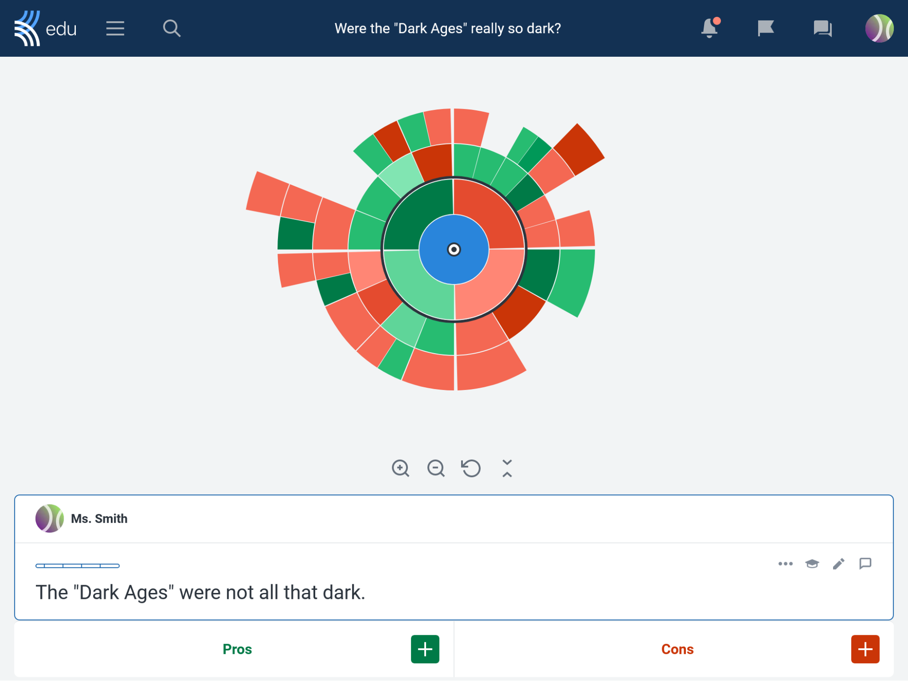
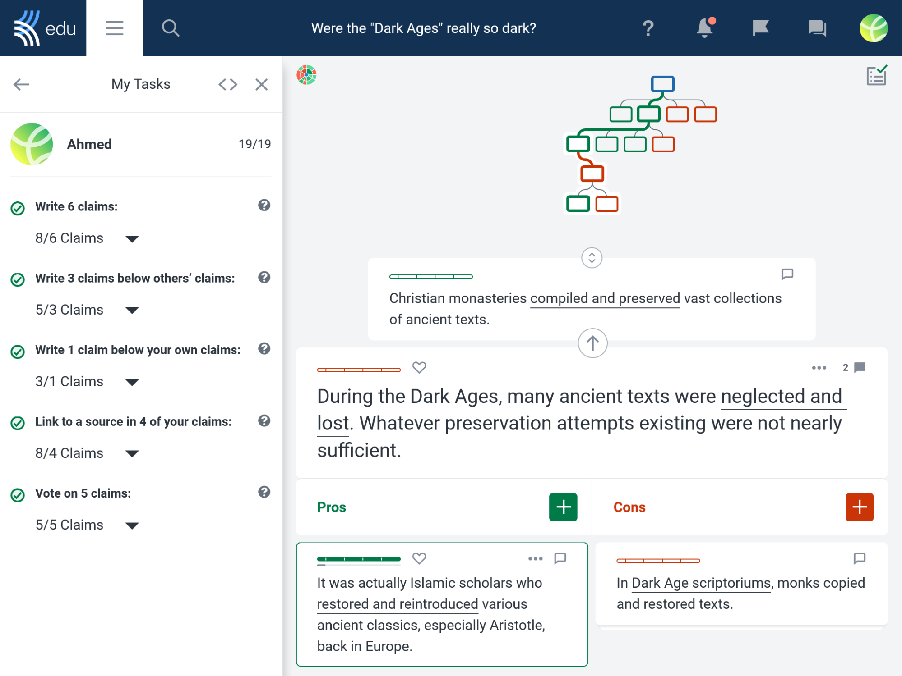

# Kialo Discussions #

Perfect for class discussions and argumentative reasoning, online debates are easy with Kialo Edu!
Motivate and empower students to have lively yet thoughtful discussions like never before.

## Table of Contents  
- [Description](#description)
    - [Our Platform](#our-platform)
    - [Our resources](#our-resources )
    - [Our policy](#our-policy)
- [Installation](#installation)
    - [Installing via uploaded ZIP file](#installing-via-uploaded-zip-file)
    - [Installing manually](#installing-manually)
- [If you need a hand](#if-you-need-a-hand)
- [Useful Links](#useful-links)
- [License](#license)

## Description ##

Ideal for classroom discussions and argumentative reasoning, the free Kialo Edu plugin lets you host online debates in an innovative argument-mapping layout.
Its visual format helps students break down complex arguments into digestible units and structure them in easy-to-follow lines of reasoning.
Our [intuitive design](https://www.kialo-edu.com/p/eafa94b6-a86f-4540-88f4-2a6250115a26/94696) also makes student collaboration and teacher feedback a breeze!

### Our platform ###

Kialo Edu is designed to develop students’ critical thinking skills and enable thoughtful discussions.
Starting from a central thesis, participants post claims supporting or refuting the claim above, with these branching out to create an argument tree.
Students can work alone or together to discuss, plan an essay/presentation, or create a review resource on a debatable topic.
Researchers have lauded [Kialo’s effectiveness](https://scholar.harvard.edu/dtingley/publications/revolutionizing-teaching-and-research-structured-debate-platform) in facilitating rational discussion. 

Educators have a range of features at their disposal.
They can assign students specific tasks, like responding to peers’ claims or providing evidence for their own.
These tasks are easy to track for the purpose of assessment.
Teacher Feedback enables targeted and discreet feedback to be given to individual claims, while the Anonymous Discussions feature lets students explore ideas without being identified by anyone but their teacher.

Kialo Edu’s design encourages reasoned, respectful discussion among students, displaying arguments logically and prompting students to back up their positions with evidence.

### Our resources ###
We have a wealth of resources to help you make the most of Kialo Edu!

The [Topic Library](https://www.kialo-edu.com/debate-topics-and-argumentative-essay-topics) has over 300 ready-to-go discussion activities for you to choose from.
Whether you are looking for ice-breaker inspiration or want to clone one of our academic resources, we have something for everyone.

Our [Edu Blog](https://blog.kialo-edu.com/) has tips and hints on how to get the most out of your Kialo discussions.
Our articles cover the pedagogical underpinnings of the platform, topical discussion ideas, teaching suggestions, and much more!

The [Release Notes](https://releases.kialo-edu.com/) keep you informed of all the major updates to our platform.
Whether we’re releasing the next major feature or streamlining your experience, read about it here first. 

### Our policy ###
Kialo Edu offers all services on its site for free.
As a nonprofit, we do not derive any financial benefit from user data.
All data collection is used solely for the purposes of improving user experience, and it is possible to use Kialo Edu without sharing any personally identifying information.
We are ISO 27001 compliant, and how we handle your data can be seen in detail in our [Data Security and Privacy Plan](https://support.kialo-edu.com/en/hc/kialo-edu-data-security-and-privacy-plan/).

## Installation ##
### Installing via uploaded ZIP file ###

1. Log in to your Moodle site as an admin and go to _Site administration >
   Plugins > Install plugins_.
2. Upload the ZIP file with the plugin code. You should only be prompted to add
   extra details if your plugin type is not automatically detected.
3. Check the plugin validation report and finish the installation.

### Installing manually ###

The plugin can be also installed by putting the contents of this directory to

    {your/moodle/dirroot}/mod/kialo

Afterwards, log in to your Moodle site as an admin and go to _Site administration >
Notifications_ to complete the installation.

Alternatively, you can run

    $ php admin/cli/upgrade.php

to complete the installation from the command line.

## If you need a hand ##
Our [Help Center](https://support.kialo-edu.com/en/) has comprehensive support for most issues you could encounter on the platform.
Please also feel free to reach out to us through our [support page](https://support.kialo-edu.com/en/contact/).

## Useful Links ##
- Source Control: https://github.com/kialo/moodle-mod_kialo
- Bug Tracker: https://github.com/kialo/moodle-mod_kialo/issues
- Documentation: https://support.kialo-edu.com/hc/en/moodle

## License ##

2023 Kialo Inc. <support@kialo-edu.com>

This program is free software: You can redistribute it and/or modify it under
the terms of the GNU General Public License as published by the Free Software
Foundation, either version 3 of the License, or (at your option) any later
version.

This program is distributed in the hope that it will be useful, but WITHOUT ANY
WARRANTY; without even the implied warranty of MERCHANTABILITY or FITNESS FOR A
PARTICULAR PURPOSE.
See the GNU General Public License for more details.

You should have received a copy of the GNU General Public License along with
this program.
If not, see <https://www.gnu.org/licenses/>.
